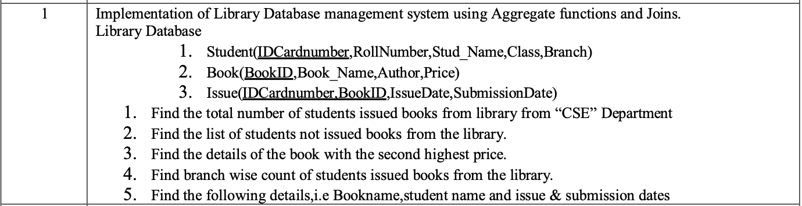

# ADS EXPERIMENT 1  
  
  
```
CREATE TABLE STUDENT(IDCARDNUMBER NUMBER PRIMARY KEY NOT NULL UNIQUE, ROLLNUMBER NUMBER NOT NULL UNIQUE, STUD_NAME VARCHAR(50), CLASS VARCHAR(20), BRANCH VARCHAR(20));
CREATE TABLE BOOK(BOOKID NUMBER PRIMARY KEY NOT NULL, BOOK_NAME VARCHAR(20), AUTHOR VARCHAR(20), PRICE NUMBER(10,2));
CREATE TABLE ISSUE(IDCARDNUMBER NUMBER NOT NULL, BOOKID NUMBER NOT NULL, ISSUEDATE DATE, SUBMISSIONDATE DATE, PRIMARY KEY (IDCARDNUMBER, BOOKID, ISSUEDATE), FOREIGN KEY (IDCARDNUMBER) REFERENCES STUDENT(IDCARDNUMBER), FOREIGN KEY (BOOKID) REFERENCES BOOK(BOOKID));

```
  
1.   
	SELECT COUNT(DISTINCT s.IDCARDNUMBER)   
  	  FROM STUDENT s  
   	  JOIN ISSUE i ON s.IDCARDNUMBER = i.IDCARDNUMBER  
    	  WHERE s.BRANCH = 'CSE';  
  
  2.
  
	SELECT * FROM STUDENT s  
	WHERE s.IDCARDNUMBER NOT IN (  
    	SELECT DISTINCT IDCARDNUMBER FROM ISSUE  
	)  
  
3.   
	  
	SELECT * FROM BOOK  
	WHERE PRICE = (  
	    SELECT MAX(PRICE) FROM BOOK  
	    WHERE PRICE < (SELECT MAX(PRICE) FROM BOOK)  
	)  
  
4.   
  
	SELECT s.BRANCH, COUNT(DISTINCT i.IDCARDNUMBER) FROM STUDENT s  
	LEFT JOIN ISSUE i ON s.IDCARDNUMBER = i.IDCARDNUMBER  
	GROUP BY s.BRANCH;  
  
5.   
  
	SELECT b.BOOK_NAME, s.STUD_NAME, i.ISSUEDATE, i.SUBMISSIONDATE  
	FROM BOOK b  
	JOIN ISSUE i ON b.BOOKID = i.BOOKID  
	JOIN STUDENT s ON i.IDCARDNUMBER = s.IDCARDNUMBER  
