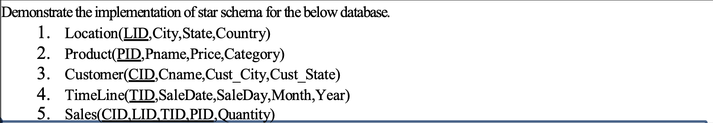

# ADS EXPERIMENT 8  
  
  
  
CREATE TABLE Location (  
    LID NUMBER PRIMARY KEY,  
    City VARCHAR2(50),  
    State VARCHAR2(50),  
    Country VARCHAR2(50)  
);  
  
CREATE TABLE Product (  
    PID NUMBER PRIMARY KEY,  
    Pname VARCHAR2(50),  
    Price NUMBER,  
    Category VARCHAR2(50)  
);  
CREATE TABLE Customer (  
    CID NUMBER PRIMARY KEY,  
    Cname VARCHAR2(50),  
    Cust_City VARCHAR2(50),  
    Cust_State VARCHAR2(50)  
);  
CREATE TABLE TimeLine (  
    TID NUMBER PRIMARY KEY,  
    SaleDate DATE,  
    SaleDay NUMBER,  
    Month NUMBER,  
    Year NUMBER  
);  
CREATE TABLE Sales (  
    CID NUMBER REFERENCES Customer(CID),  
    LID NUMBER REFERENCES Location(LID),  
    TID NUMBER REFERENCES TimeLine(TID),  
    PID NUMBER REFERENCES Product(PID),  
    Quantity NUMBER,  
    PRIMARY KEY (CID, LID, TID, PID)  
);  
  
INSERT INTO Location VALUES (1, 'Mumbai', 'Maharashtra', 'India');  
INSERT INTO Location VALUES (2, 'Pune', 'Maharashtra', 'India');  
INSERT INTO Product VALUES (101, 'Laptop', 55000, 'Electronics');  
INSERT INTO Product VALUES (102, 'Mobile', 20000, 'Electronics');  
INSERT INTO Customer VALUES (201, 'Amit Sharma', 'Mumbai', 'Maharashtra');  
INSERT INTO Customer VALUES (202, 'Riya Patil', 'Pune', 'Maharashtra');  
INSERT INTO TimeLine VALUES (301, DATE '2025-01-01', 1, 1, 2025);  
INSERT INTO TimeLine VALUES (302, DATE '2025-01-02', 2, 1, 2025);  
INSERT INTO Sales VALUES (201, 1, 301, 101, 2);  
INSERT INTO Sales VALUES (202, 2, 302, 102, 3);  
  
  
SELECT   
    c.Cname,  
    p.Pname,  
    l.City,  
    t.SaleDate,  
    s.Quantity,  
    p.Price,  
    (s.Quantity * p.Price) AS TotalAmount  
FROM Sales s  
JOIN Customer c ON s.CID = c.CID  
JOIN Product p ON s.PID = p.PID  
JOIN Location l ON s.LID = l.LID  
JOIN TimeLine t ON s.TID = t.TID;  
  
SELECT l.City, SUM(s.Quantity) AS Total_Quantity  
FROM Sales s  
JOIN Location l ON s.LID = l.LID  
GROUP BY l.City;  
  
SELECT p.Pname, SUM(s.Quantity * p.Price) AS Revenue  
FROM Sales s  
JOIN Product p ON s.PID = p.PID  
GROUP BY p.Pname;  
